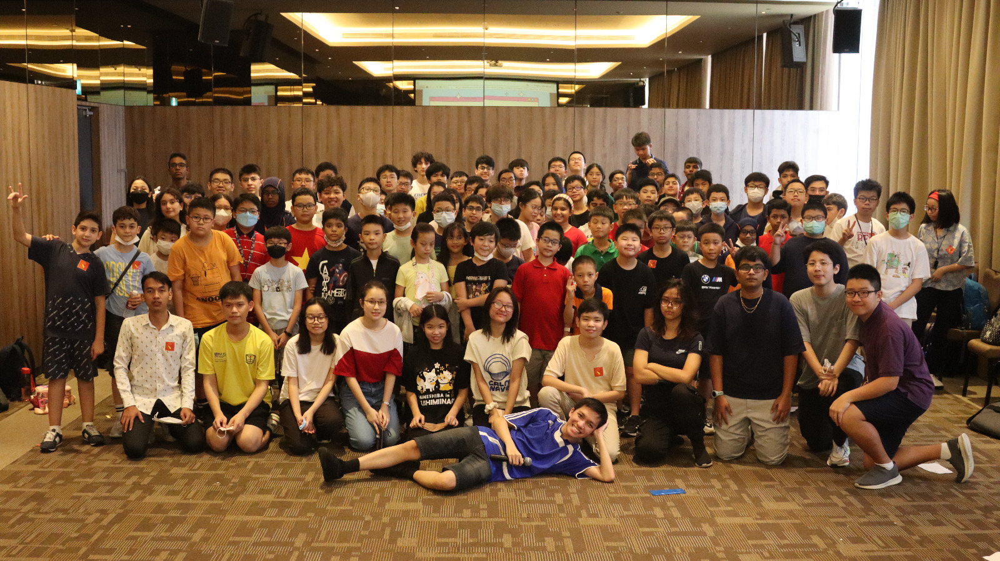

### 📂 This repository is now archived as a finished project.

# YALA 2022 Recap

> Greetings IJHS fellows! We hope you are doing well.
>
> We want to share a big thank you for being one of the **180+ scholars** from **more than 14 countries** in our 5th-ever YALA Camp, also the first in-person camp since the pandemic in 2022. We enjoyed hearing all of your great ideas and seeing all of you blossom into great young leaders throughout the camp - we really hope you enjoyed it as well!
>
> Throughout the camp, we took **a lot of pictures** about the various activities and events that happened, and we want to share them with you. Thanks again for joining us, and we hope to **see you again in 2023!**
>
>**- The IJHS Global Student Leadership Council (GSLC)**

## For those who are interested

This project was bootstrapped with [Create React App](https://github.com/facebook/create-react-app). You can learn more in the [Create React App documentation](https://facebook.github.io/create-react-app/docs/getting-started).
